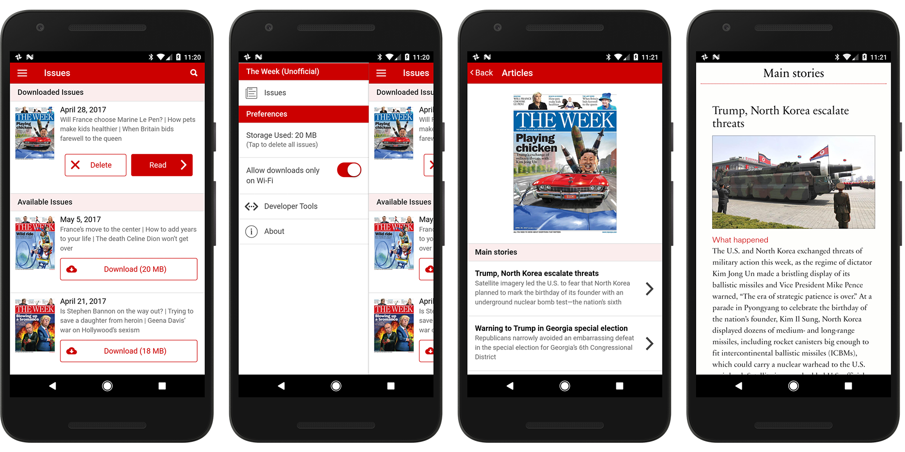

Unofficial app for _The Week_ magazine
===

This is an unofficial app for _[The Week](https://theweek.com/)_ magazine.

The [official Android app](https://play.google.com/store/apps/details?id=com.dennis.theweek.us&hl=en) stopped working as of Android 6.0 (marshmallow). It simply crashes on startup. I am not the only one to experience this, as can be seen in the Google Play store reviews.

The magazine website has since pulled all mention of an Android app from their website. This seems to indicate they are no longer supporting it.

Therefore, I have created this unofficial app so Android users can continue to read the magazine.

I am not affiliated with _The Week_ in any way.

## Releases

Pre-built Android APKs are available on the [releases page](https://github.com/Justin-Credible/the-week-magazine-unofficial/releases).

While this app is built with cross-platform tech (Ionic/Cordova), a portion of it uses a native plugin which I've only written for Android. Since the official iOS app still works, there is no reason to make this app work on iOS for now.

As a learning exercise, I'm also porting this app to Dart/Flutter which can be found [here](https://github.com/Justin-Credible/the-week-magazine-unofficial-flutter).
